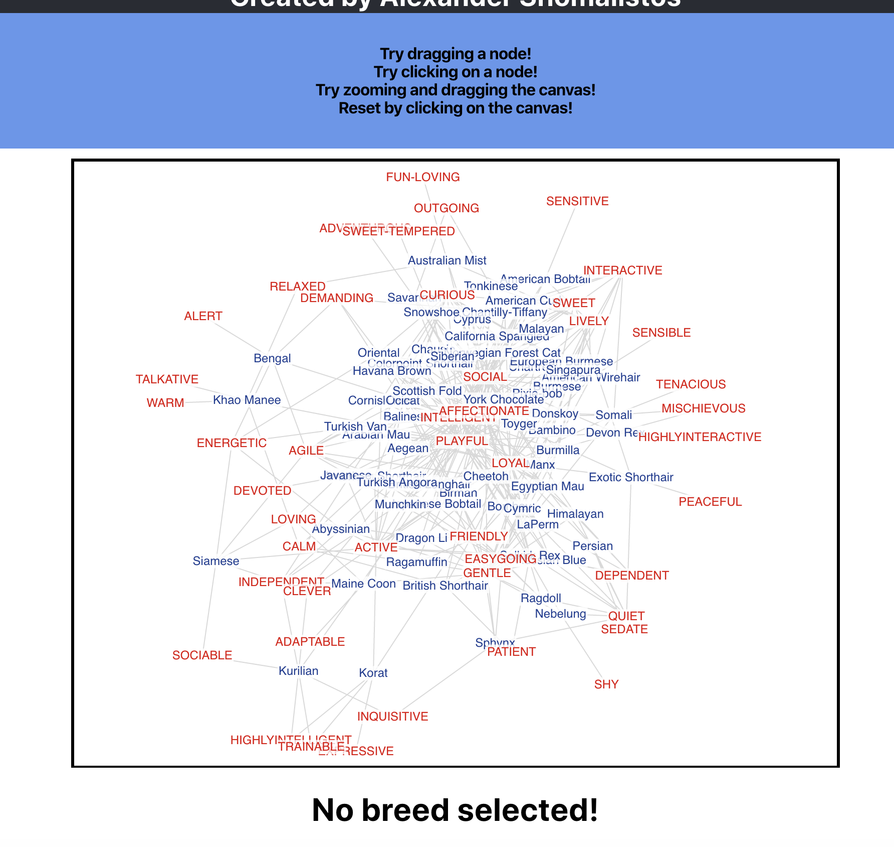
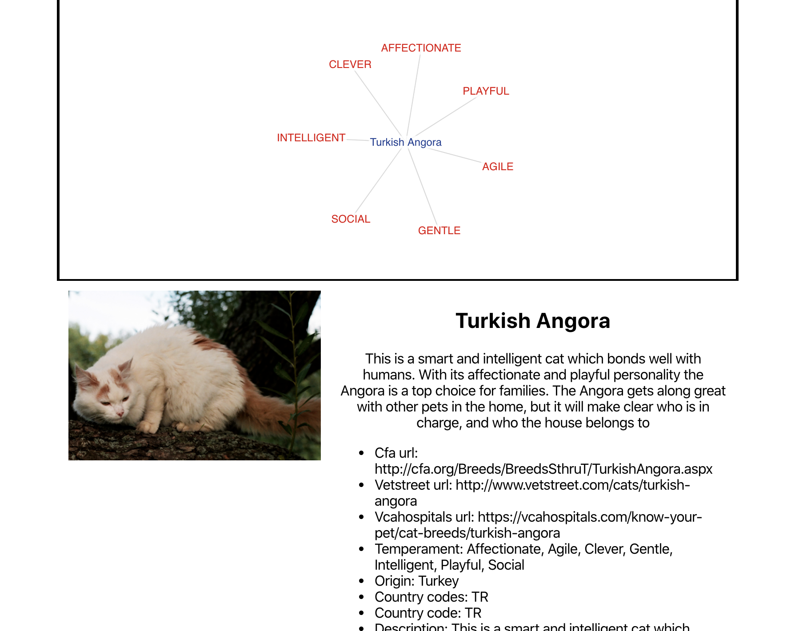

## Welcome

This Single Page Application renders data from the The Cat API breeds endpoint (https://thecatapi.com/) in an interactive force directed graph. It shows relationships based on the temperament of each breed. It also renders the full breed information when a specific breed (node) is selected on the graph, as well as fetching a random example image of that cat breed.

### Technologies

The application uses React and react-force-graphs-2d. It also uses Jest and enzyme for testing. 

### Set-up

The API key is stored in a local environment variable so it will not work out of the box if cloned. You will need to input your own developer key for the https://thecatapi.com/ API. It can be done with dotenv in a .env file in the root directory with the key set to REACT_APP_CAT_API_ID=<key>.

Once this is done you can:
--run npm install to update node modules
--run npm start to start the dev server

### Testing

There is a basic test suite for just one component as an example of testing capabilities. Similar techniques could be extended to the rest of the application.

To use:
-- run npm test

## Credit

Created by Alexander Shomalistos. Do not reproduce or edit without express permission. Thanks for using my app!